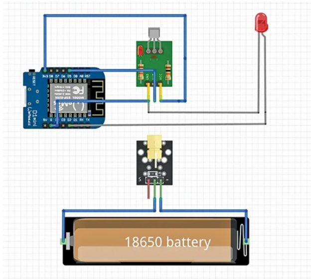

# 🔦 Optical Fence Intrusion Detection System

A laser-based intrusion detection system built with ESP8266 that logs security events to the cloud in real time via Google Apps Script.

---

## 📌 Overview

This system creates an invisible optical fence using a laser module and optical receiver. When the laser beam is broken by an intruder, the ESP8266 immediately detects the breach and logs the event to a Google Sheet — no internet server required.

---

## 🎥 Demo

https://github.com/SadvikaPaidiwar/Optical-Fence-IoT/raw/main/demo.mp4

---

## ⚙️ Features

- Real-time intrusion detection using laser beam interruption
- Instant cloud logging via Google Apps Script → Google Sheets
- Offline-capable ESP8266 microcontroller (WeMos D1 Mini)
- Low power, low cost, and easy to deploy
- Timestamped event logs for audit and monitoring

---

## 🛠️ Components Used

| Component | Purpose |
|---|---|
| WeMos D1 Mini (ESP8266) | Main microcontroller + WiFi |
| Laser Module (5mW) | Transmits the optical beam |
| Optical / LDR Receiver | Detects beam interruption |
| Google Apps Script | Receives HTTP POST and logs to Sheet |
| Arduino IDE | Development environment |
| 18650 Battery | Powers the circuit |

---

## 📐 Circuit Diagram



---

## 📷 Hardware Setup


---

## 🚀 How It Works

```
Laser beam ON → Optical receiver detects light → System in safe state
Laser beam BROKEN → Receiver output changes → ESP8266 detects trigger
→ HTTP POST sent to Google Apps Script
→ Event logged to Google Sheet with timestamp
```

---

## 💻 Setup Instructions

### 1. Clone this repo
```bash
git clone https://github.com/SadvikaPaidiwar/Optical-Fence-IoT.git
```

### 2. Configure Google Apps Script
- Create a new Google Sheet
- Go to **Extensions → Apps Script**
- Paste the provided script
- Deploy as **Web App** → Copy the URL

### 3. Update WiFi credentials in `OpticalFence.ino`
```cpp
const char* ssid     = "YOUR_WIFI_SSID";
const char* password = "YOUR_WIFI_PASSWORD";
const char* scriptURL = "YOUR_APPS_SCRIPT_URL";
```

### 4. Flash to WeMos D1 Mini
- Open `OpticalFence.ino` in Arduino IDE
- Select board: **LOLIN(WeMos) D1 R2 & mini**
- Upload and open Serial Monitor at **115200 baud**

---

## 📊 Sample Log Output (Google Sheet)

| Timestamp | Event | Status |
|---|---|---|
| 2025-10-14 09:32:11 | Beam Broken | INTRUSION DETECTED |
| 2025-10-14 09:32:45 | Beam Restored | SYSTEM NORMAL |

---

## 🧰 Libraries Required

- `ESP8266WiFi.h`
- `ESP8266HTTPClient.h`
- `WiFiClientSecure.h`

Install via Arduino IDE → Library Manager.

---

## 📁 Project Structure

```
Optical-Fence-IoT/
├── OpticalFence.ino        # Main Arduino sketch
├── CircuitDiagram.png      # Circuit schematic
├── HardwareConnection.png  # Physical hardware setup
├── demo.mp4                # Project demo video
├── LICENSE
└── README.md
```

---

## 👩‍💻 Developer

**Paidiwar Sadvika**  
B.Tech EEE — BVRIT Hyderabad College of Engineering for Women  
[GitHub](https://github.com/SadvikaPaidiwar)

---

## 📄 License

MIT License — free to use and modify with attribution.
