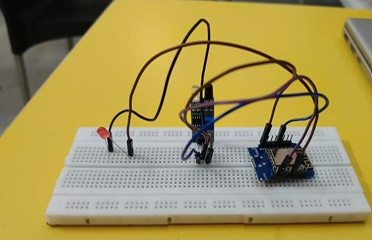

# Optical-Fence-IoT
IoT-based Optical Fence Security System using WeMos D1 Mini, Laser Sensor, and Google Sheets Integration for real-time intrusion detection and monitoring.
# Optical Fence IoT Security System

## Overview

The Optical Fence is an IoT-based intrusion detection system developed using the WeMos D1 Mini (ESP8266), laser transmitter, and optical receiver module. The system detects unauthorized access when the laser beam is interrupted and logs intrusion events to Google Sheets through Wi-Fi connectivity.

## Features

* Real-time intrusion detection
* Wi-Fi enabled monitoring
* Google Sheets data logging
* LED/Buzzer alert indication
* Low-cost security solution

## Components Used

* WeMos D1 Mini (ESP8266)
* Laser Module
* Optical Receiver Module
* LED/Buzzer
* 18650 Battery
* Breadboard and Jumper Wires

## Working Principle

1. The laser transmitter continuously sends a beam.
2. The optical receiver detects the beam.
3. When the beam is interrupted, an intrusion is detected.
4. The ESP8266 processes the event.
5. Data is logged to Google Sheets with a timestamp.
6. LED/Buzzer alerts are activated.

## Applications

* Home Security
* Office Security
* Restricted Area Monitoring
* Industrial Safety Systems

## Files Included

* OpticalFence.ino
* CircuitDiagram.png
* HardwareConnection.png
* Demo.mp4

## Author

Sadvika Paidiwar
EEE Student  IoT Enthusiast
## Circuit Diagram

## Hardware Setup

